# Wm Cadenhead

* Address: 172, Canongate, Aberdeen or 9, Bolgam Street, Campbeltown, Argyll, PA28 
* Web: [https://www.cadenhead.scot/](https://www.cadenhead.scot/)
* Tel: 0131-556 58 64 Fax: 556-25 27
* Proprietor: J.A. Mitchell 

|Brand Marks|
|:---------:|
|   |

Cadenhead is Scotland's oldest independent bottler and was founded in Aberdeen in 1842 by Wm Cadenhead and G. Duncan. In 1972, the company was taken over by its present owner. The Head office of the company has moved to Campbeltown then because the warehouses are located there too. The Cadenhead bottlings are bottled by the bottling plant of Springbank.

Cadenhead has bottled without chill-filtration at all times (first only at 46% ABV, later on at natural Cask Strength also) and therefore paved the way for Single Cask Bottlings. The individuality of a single cask is most focal for Cadenhead; thus, it can happen, that two bottlings of the same distillery and with the same age tastes completely different. For Cadenhead the constancy of the Whisky-quality in taste is for Cadenhead obviously less important than the individuality of the cask.

Cadenhead's Shops can be found in Aberdeen, Edinburgh, Campbeltown, London, Cologne and Amsterdam.

    The Cadenhead's colourcode for the current labels of the Original and Authentic Collection:
    1st line (from left to right): Speyside, Island, Lowland, Islay and Campbeltown
    2nd line (from left to right): North, South, East and West Highland.

There could be named several reasons for the disappearance of the nice ClearLabel-bottles. On one hand, the Cadenhead's-Logo, which is pasted directly on the bottle, shall be emphasized in comparison to the name of the distillery. Everybody shall see, that there is a Glenfarclas from Cadenhead's and not a Cadenhead's bottling of a cask, which is distilled at Glenfarclas-distillery.

Hence, the name of the distillery has taken a back seat and is more difficult to find on the label - but you can see right away, that it is a Bottling from Cadenhead's. The formerly used green-glass bottle has changed to a clear one. One reason might be to show that the whisky is not artificially coloured, which you couldn't see in a green bottle.

Last but not least, the fun in creating a new design and the changing desires for a new label among the company’s leaders play a pivotal part in such a step. 

## Original Collection

Only spring water is added to the Original Collection-whiskies to bring it to drinking strength at 46% ABV. There has been no colouring or chill-filtration. Every whisky is a single cask bottling. It is filled in a clear glass bottle with Tube. Older Bottlings of the Original Collection have a green label with a white tab in the middle containing the information. In between there was another design with clear label and oval tab. The new design from 2003 will be described later with the Authentic Collection.

|Description|Bottle|
|-----------|------|
|Original Collection with big green label, small oval label and a special edition of the Authentic Collection for the 150th anniversary of Cadenhead's with a black and white label.||
|The design of the Original Collection until 2003. (photograph: by the Cadenheads.de website)||
|The Original Collection has sometimes the same labels as the Bond Reserve. (photo: Cadenheads.de)||

##  Authentic Collection

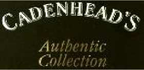

The Authentic Collection-whiskies, unlike to the Original Collection-whiskies, are bottled at their natural matured cask strength. Again, there are no additions for colouring or chillfiltration. And again: only single cask bottlings can be found. Older
bottlings may be raw cask without any filtration and may include  particles of the wood. It has been bottled in a dark green bottle with Clear Label (printed on the bottle) and a small tab with the dates of the bottling. These
bottles are usually packed in a black cardboard box. New bottlings are packed in a tube with modernized design (a bit improper in my opinion).

In the beginning of the 1990s, on the occasion of the 150th anniversary, Cadenhead bottled a special edition in a green bottle with a black label. The former bottlings from the 1980s are in a brown dumpy bottle! (q.v. dot (d) other), sometimes with a white label. Both types of bottlings are not available nowadays in regular trade.

In the beginning of the 90th, on the occasion of the 150th anniversary, there was bottled a special edition in a green bottle with a black label. The former bottlings from the 80th are in a brown dumpy bottle! (q.v. dot (d) other), sometimes with a white label. Both types of bottlings are not available nowadays in regular trade.

In the middle of the year 2003 the design of the label changed again. The script is written in gold, the ribbon with the Cadenhead-logo was placed in the bottom right corner and the data field on the left. It looks a bit better than before. 

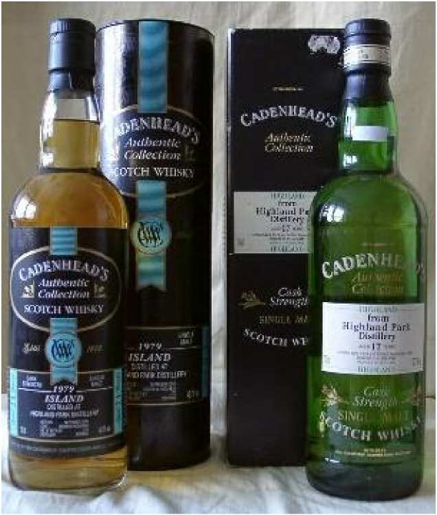

Old and new:
Two Highland Parks dest. in 1979 by Cadenhead's. On the **left** is a bottling of the year 2000 and on the right of 1996 with Clear Label. The banderole of the cap dissapeared at the new bottlings. 

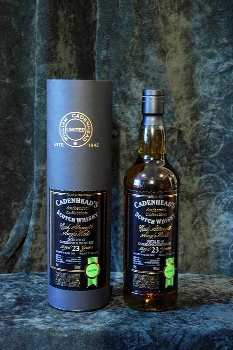

The Authentic Collection since 2003 with black tube and the redesigned label. (photo: Cadenheads.de) 

## Chairman's Stock

|Brand Marks|
|:---------:|
|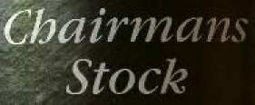  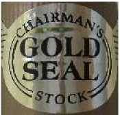|

This is the luxury class bottlings from Cadenhead's. The casks from which these bottlings from were purchased from the private stock of the Chairman. These are excellent whiskys in general, which are favoured by collectors, too. Bottled without any additives or chill-filtration as always. 

In former times the bottles of the Authentic Collection were used and only a golden seal was pasted on the cap. You shouldn't be confused from the writing “Authentic Collection” of the clear label bottle. At the end of the 1990s, there is a modernised packaging with a golden tube and paper label, no longer a clear label bottle.

Chairman's Stock bottlings are on a high-prized-level and these bottlings shall be discontinued in 2003 with the golden tube packaging, the last one shall be a Glenlossie 24yo. The new packaging is a black leatherbox with a window. 

|Description|Bottle|
|-----------|------|
|The newest packaging of the Chairman’s-Stock-range is more exclusive and the label was changed to match the style of the Authentic Collection. (photo: cadenheads.de)|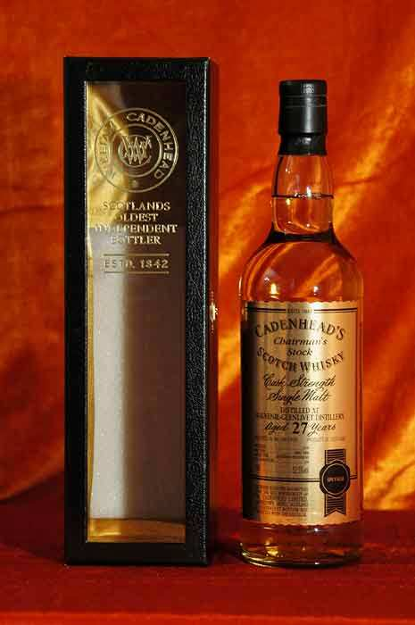|
|Golden: Chairman's Stock in a modern design|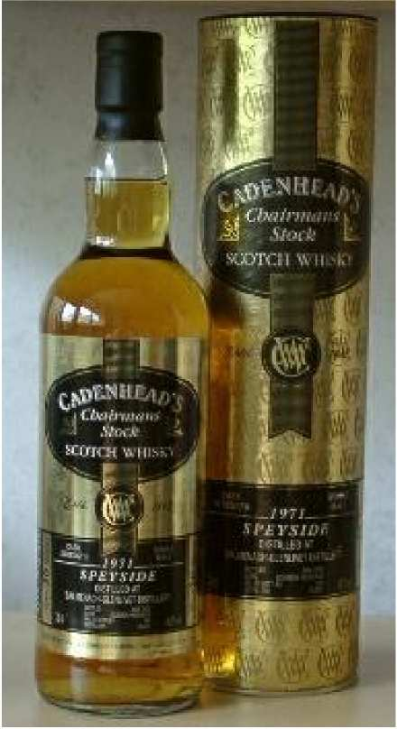|
|Little differences: Unlike the Authentic Collection (which can be read on the bottle in the middle of the clear label) the cap is bronze and has a golden seal (look also at the small picture above). This Royal Brackla was bottled in 1992.|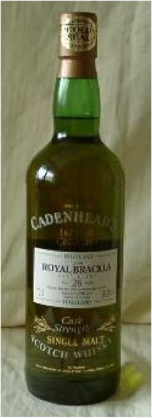| 

## Bond Reserve / 1842 / Classic

Cadenhead's released other ranges and so-called Shop-specials like the Bond Reserve, the Classic-range and Cadenhead’s 1842. The Bond Reserve and 1842 are bottled at caskstrength–1842 even straight from the cask–while the Classic-range has 50% ABV. 1842 and Classic are named with their regional production area, i.e. Highlands, Islay etc. Cadenhead's offers a rum under the 1842-label, too.

|Description|Bottle|
|-----------|------|
|A Bond Reserve bottling|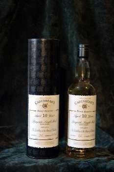|
|The Pure Malt from the Classic range in the Dumpy bottle. (both photos: cadenheads.de)|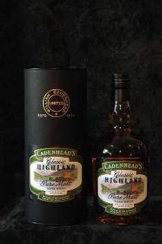

## Closed Distilleries

After some years there is something new from the oldest Independent Bottler: The Closed Distilleries – range. As the name says, in this range there are whiskies from closed distilleries only. The Closed-Distilleries bottlings are placed in the upper price segment and are presented in a so-called leather box with a window. Bottled at cask-strength, the first bottlings appear in 2005/06. 

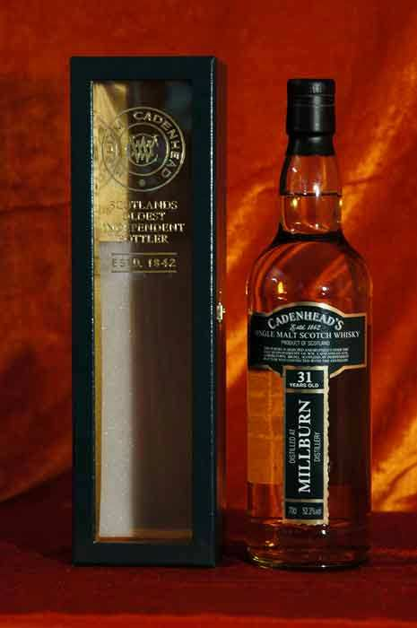

The Closed – Distillery – range with leather box and a uncommon designed label. (photo: cadenheads.de) 

## Duthie's

This sub-label was used for Single Malt bottlings by Cadenhead's until 1994. The bottlings appeared with different labels and alcohol-levels. The clear standard bottle was used as well as a green bottle. This label is named after Robert W. Duthie, who was leading Cadenhead's from 1904 until 1931. 

|Description|Bottle|
|-----------|------|
|These Bowmore were bottled by Cadenhead’s under the label DUTHIE'S|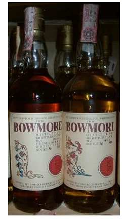|
|Highland Park on the right, also! (photo: whiskyfair.de)|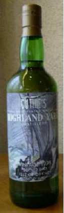|

##  Others

There is a collection of "Cadenhead's World Whiskies", too. These are Bottlings with bourbon, canadians, single grain whiskies and whiskies from other countries as well. Cadenhead produces some blends (Putachieside, Hielanman and Moidart) and stores Demerara-Rum as well and sells Cognac and Wine also. 

|Description|Bottle|
|-----------|------|
|In the beginning of the 90s the green bottle was used for the first time for the 150th anniversary|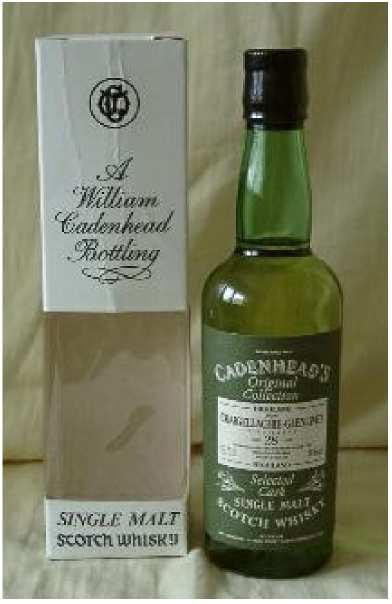|
|A brown dumpy bottle dest. In 1984! Normally in a black cardboard box (photo by: Jürgen Marz)|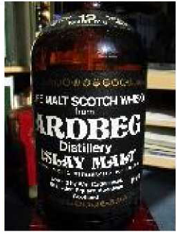|
|Some Cadenhead´s bottlings are available as 0,35l bottles, too –with screw-cap. The Name of the distillery and the ABV are on the backside of the bottle.|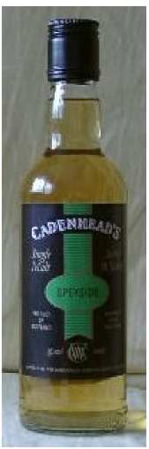|
|Handwritten lable on a small bottle!|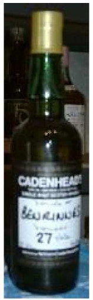|
|Original Collection with green label.|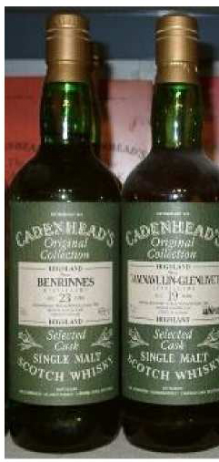|
|Cadenhead’s bottles with a big beige label for the japanese market.|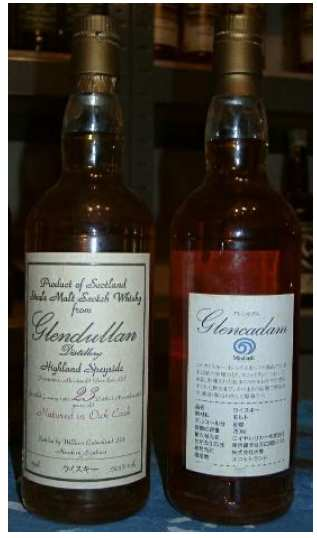|
|Though this bottling is a Glendullan the cap shows the  Springbank-S!!! (Springbank is owned by the same family as Cadenhead's).|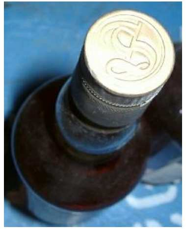|
|A Lammerlaw from the Cadenhead’s World Whiskies range using the bottle of the Authentic Collection. (photo: Lothar Müller)|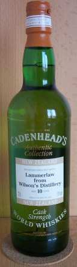|

[Back to Parent](IndependentBottlers.md)

<!--
TODO: 
* modernize
* add small batch / cask strength / golden / anniversary
* add blends line 
-->