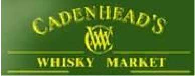
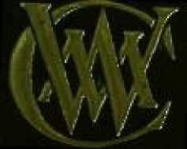
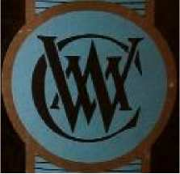
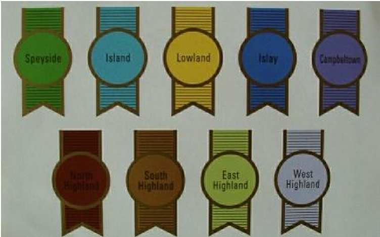
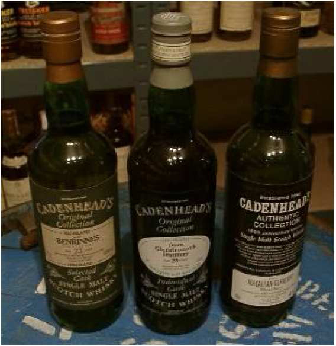
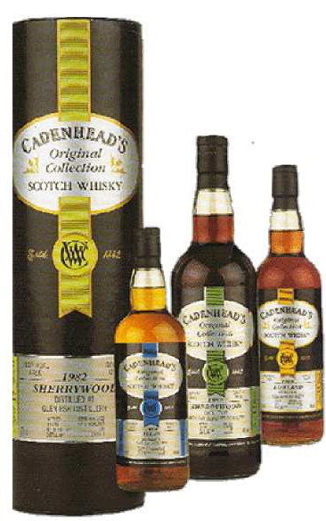
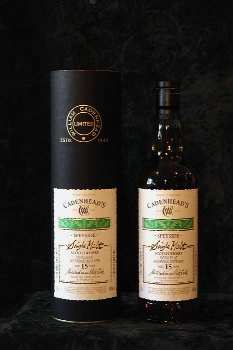

# Wm Cadenhead

    Address: 172, Canongate, Aberdeen or 9, Bolgam Street, Campbeltown, Argyll, PA28 
    Web: [https://www.cadenhead.scot/](https://www.cadenhead.scot/)
    Tel: 0131-556 58 64 Fax: 556-25 27
    Proprietor: J.A. Mitchell 

|Brand Marks|
|:---------:|
|   |

Cadenhead is Scotland's oldest independent bottler and was founded in Aberdeen in 1842 by Wm Cadenhead and G. Duncan. In 1972, the company was taken over by its present owner. The Head office of the company has moved to Campbeltown then because the warehouses are located there too. The Cadenhead bottlings are bottled by the bottling plant of Springbank.

Cadenhead has bottled without chill-filtration at all times (first only at 46% ABV, later on at natural Cask Strength also) and therefore paved the way for Single Cask Bottlings. The individuality of a single cask is most focal for Cadenhead; thus, it can happen, that two bottlings of the same distillery and with the same age tastes completely different. For Cadenhead the constancy of the Whisky-quality in taste is for Cadenhead obviously less important than the individuality of the cask.

Cadenhead's Shops can be found in Aberdeen, Edinburgh, Campbeltown, London, Cologne and Amsterdam.

    The Cadenhead's colourcode for the current labels of the Original and Authentic Collection:
    1st line (from left to right): Speyside, Island, Lowland, Islay and Campbeltown
    2nd line (from left to right): North, South, East and West Highland.

There could be named several reasons for the disappearance of the nice ClearLabel-bottles. On one hand, the Cadenhead´s-Logo, which is pasted directly on the bottle, shall be emphasized in comparison to the name of the distillery. Everybody shall see, that there is a Glenfarclas from Cadenhead´s and not a Cadenhead's bottling of a cask, which is distilled at Glenfarclas-Destillery.

Hence, the name of the destillery has taken a back seat and is more difficult to find on the label - but you can see right away, that it is a Bottling from Cadenhead´s. The formerly used green-glass bottle has changed to a clear one. One reason might be to show that the whisky is not artificially coloured, which you couldn't see in a green bottle.

Last but not least, the fun in creating a new design and the changing desires for a new label among the company’s leaders play a pivotal part in such a step. 

## Original Collection

Only spring water is added to the Original Collection-whiskies to bring it to drinking strength at 46% ABV. There has been no colouring or chill-filtration. Every whisky is a single cask bottling. It is filled in a clear glass bottle with Tube. Older Bottlings of the Original Collection have a green label with a white tab in the middle containing the information. In between there was another design with clear label and oval tab. The new design from 2003 will be described later with the Authentic Collection.

|Description|Bottle|
|-----------|------|
|Original Collection with big green label, small oval label and a special edition of the Authentic Collection for the 150th anniversary of Cadenhead´s with a black and white label.||
|The design of the Original Collection until 2003. (photograph: by the Cadenheads.de website)||
|The Original Collection has sometimes the same labels as the Bond Reserve. (photo: Cadenheads.de)||
## 

[Back to Parent](IndependentBottlers.md)