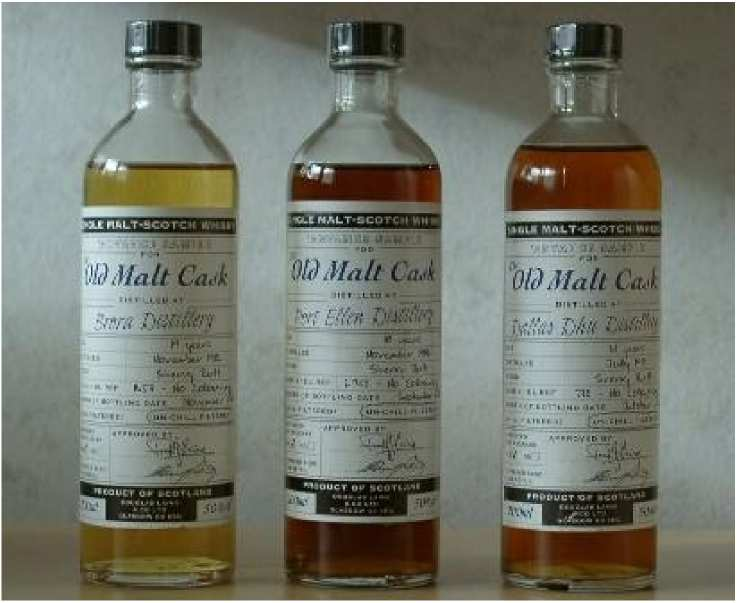
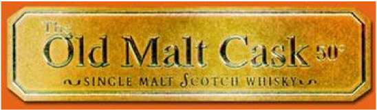
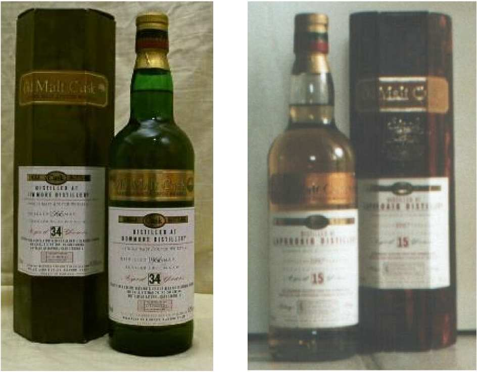
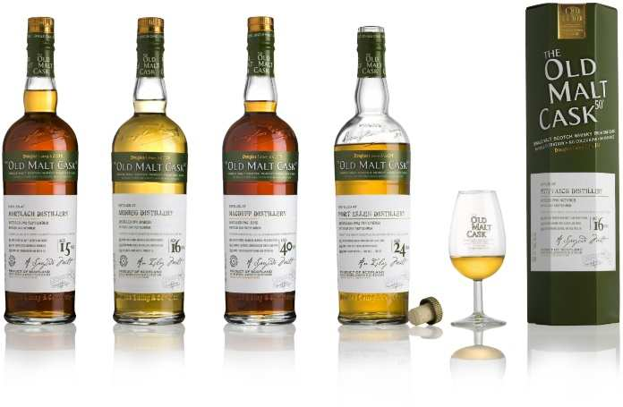
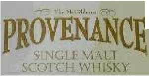
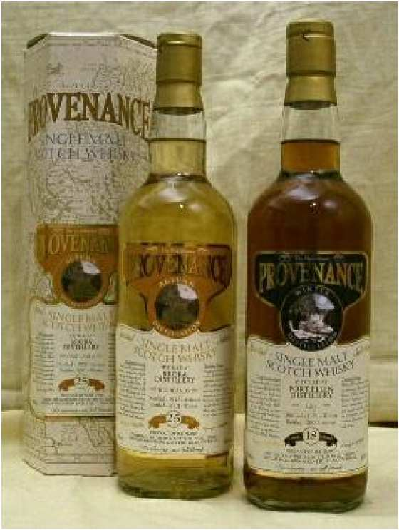
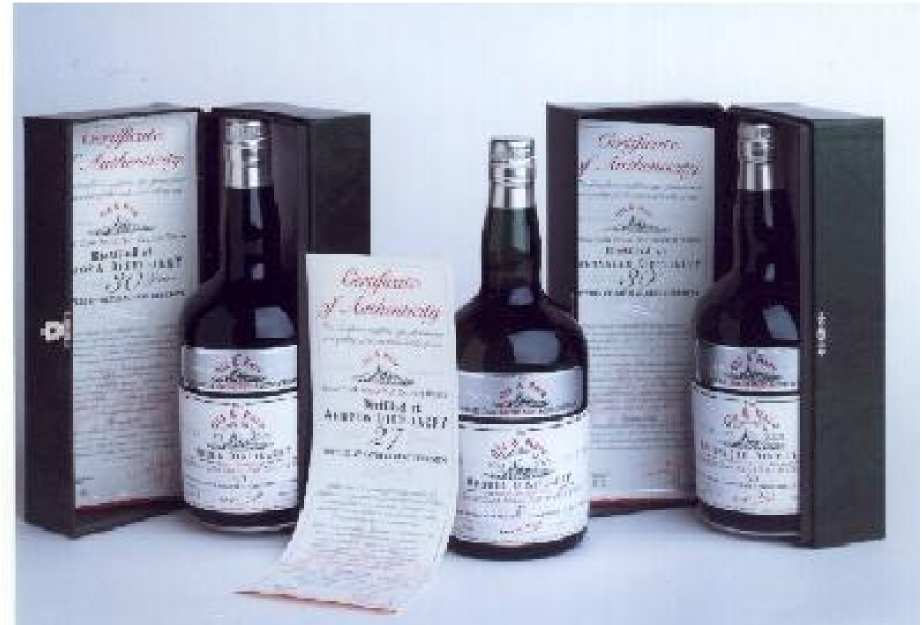
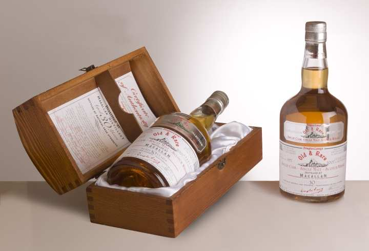
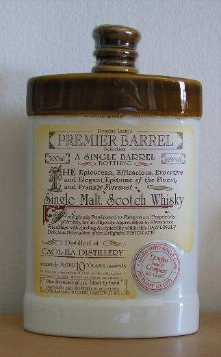
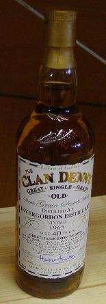

# Douglas Laing

* Address: Douglas Laing & Co Ltd., Glasgow G3 6EQ
* Web: [https://www.douglaslaing.com/](https://www.douglaslaing.com/)
* Tel: ?
* Proprietor:  Fred & Stewart Laing 

This independent bottler started as a blender. The company was founded in 1949 by Fred Douglas Laing. Single Malts were bottled since 1999. Today's proprietors decided that most of their casks in stock are too good for blending. Originally, they had the wish to bottle 50 bottlings of different distilleries for their 50th company anniversary. 

This was the birth of the OLD MALT CASK series as we know today, D.Laing has bottled more than 50 bottlings –and still there are coming more!

D. Laing owns a big stock of casks, partly very old ones. These casks are used for blending or were bottled as Single Malts.

Since the middle of the 1990s there is a Joint-venture with the company "Kedir" (India). 

## Advanced Series

The Advanced Series is bottled only in small bottles with 0,2l. The bottlings have 50% ABV. The bottle has an uncommon short neck and a plastic screw cap. No chill-filtration or
coloring has been used. 

Apparently, D. Laing wants to get new customers, who either cannot afford or don't want to buy the "big" bottles of the Old Malt Cask series.

New are 2 bottlings for cigar smokers. One Islay-bottling for those who prefer a stronger taste and a bottling from the Highlands for those who prefer a mellow taste. The label of these 2 bottlings is similar to the OMC range. 

    For a real tasting: The 200ml samples of the Advanced Series. 

## Old Malt Cask

The packaging of this series is a 6-edged wine-red or green paper box, using a clear or green bottle. Only single cask bottlings are offered. Neither the cask number nor the bottle number is
shown on the label, but the whole number of bottles, which were bottled from the cask is written on the label. 

That’s why it’s a little bit difficult to name exactly a special bottling (look at the numerous Ardbeg-bottlings). However, the year of the bottling and distillation can be found on the label.
 
Usually the OLD MALT CASK is bottled at 50%, but there were several bottlings released in cask strength. These Malts are neither colored nor chill-filtered. 

On some bottlings, a bolded "Single Cask Bottling" is printed on the paper box.  There are existing a number of special bottlings i.e. for Alambic - Germany, for Islay Whisky Shop, for The Whisky Shop - Speyside Way Bar (Tokyo) and others. 

In the beginning of 2008, almost 10 years after launching the OMC-range, the label has been changed to a more modern version. 

    Left: Only 96 bottles were bottled of this Bowmore distilled 1966. The small, golden label and the green/red cap is  typical for the Old Malt Cask-series.
    Right: The Old Malt Casks bottled in a clear bottle with the wine-red paper box and the bolded "Single Cask Bottling" printed on the box! (Photo by: Teresia Kuhr)

    The new label of the OMC-range. The bottle is more elegant now and has an imprinted Douglas-Laing-signing on the shoulder (photo: douglaslaing.com) 

TODO: 200th anniversary OMC bottlings

## McGibbons Provenance

The Provenance-range, which is released by the DL subsidiary THE MCGIBBON'S, has a clear standard bottle and a white 6-edged paper box. Its common bottling strength is 43%, but some bottlings are available with 46% or at cask strength. 

The year of the distillation and the bottling can be found on the label. Additionally there is a small picture of the season (spring, summer, autumn and winter) when it was distilled.

Further, there is a small tasting note on the label. While most bottlings have no cask number written on the label, there are single casks bottlings in this series.  On the label of these bottlings you can find the casknumber. No chillfiltering or coloring has been used in this series.

    Season greetings:
    A Brora of the "Autumn-Distillation" on the left and a Port Ellen of the "Winter Distillation". 
    On the very left you can see the 6edged paper box of the Provenance bottlings. 

## Platinum / Old & Rare Selection

This series is relatively new. It started in 2002, I think. It’s a series for the collector. The first bottlings of the Platinum-series were only bottled for the japanese market. After a short time a set of 6 bottlings appeared on the european market also. 

The Platinums are single cask bottlings, bottled at cask strength. In D. Laing's opinion, they are one of the best malts they have bottled ever. Partly, the malts of this series have been matured more than 30 years! 

The packaging is a dark-green big-box (cardboard), containing a green dumpy-bottle and a so called certificate of authenticity. The Platinum-range has changed its name officially to Old & Rare Selection in the meantime. The package is now a wonderful wooden casket. 

    Some bottlings of the Platinum-series from D.Laing
    (Photo by: official promotional photo from the internet) 

    The Old & Rare Selection with the new packing, better known as Platinum Selection.
    (photo: douglaslaing.com) 

## Premier Barrel Selection

Another range for all the collectors among us. Till now there has been released only one bottling of a 10 yo. Caol Ila.  It comes in a porcelain decanter and was bottled at 46%.  This decanter is packaged in an extravagant wooden box. 

The design of the decanter should remind the drinker of Victorian England. Of course, this is a limited bottling and the bottle number is shown on the decanter. 

    Old England: The beautiful porcelain decanter of the Premier Barrel Selection.
    (photo: Stephan Weigel) 

## Clan Denny

This is a sub-label of Douglas Laing! The Laings want to bottle a range of old single grain whiskies under this label – starting in 2005. On the label you can read that this range is bottled for Hunter Hamilton, which is a subsidiary of D. Laing.

    This 40yo. Invergordon is the first single grain in this range. 

[Back to Parent](IndependentBottlers.md)

<!--
TODO: 
* add Big Peat, other DL newer stuffs, XOP
* https://www.douglaslaing.com/about-us/our-history/
* https://www.douglaslaing.com/our-whisky/
-->