# Gordon & MacPhail 

* Address: G&M,George House Boroughbriggs Road, Elgin, Moray, IV30 1JY, UK
* Web: [https://www.gordonandmacphail.com/](https://www.gordonandmacphail.com/)
* Tel: 01343-545111 Fax: 01343-540155
* Proprietor:  Fam. Urquhart

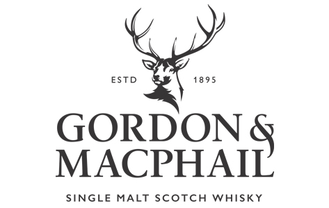

G&M is one of the most distinguished independent bottlers of single malt whisky. After the last war only a few people outside scotland knew about single malts, because nearly the complete amount of production was used for blending. Because of the closing of many distilleries some whiskies survived only at G&M as a single malt. G&M owns a big stock of old casks of nearly any distillery.

The company G&M was founded in 1895 by James Gordon and John Mac Phail in Elgin. The Head Office is still in the same building. From outside you wouldn't think of a whisky shop, because G&M started as a grocery, and it is still one. So you have to search for the whiskies which are at the end of shelves full of cheese, sausages and other foods. 

Beside the G&M-bottlings they sell several Original bottlings as well. In 1993, the company purchased Benromach Distillery, adding "distiller" to its list of titles. In 1998 the Benromach distillery was reopened and with the release of the Benromach Traditional followed the first own Single Malt from G&M in 2004. 

## Distillery Labels

The G&M standard bottlings are in a different package than the Connoisseurs Choice whiskies. There is a screw cap too, and they are bottled as a rule at 40%ABV; but some bottlings are available at natural cask strength, too. For exportation there are also bottlings with unusual 46% ABV and cork stopper. The labels of the G&M standard collection are different in dependence on the distillery. Usually the name of the distillery is sizable on the Label. The style of the packaging has changed several times. 

|Description|Bottle|
|-----------|------|
|Odd Strathisla: Both Strathislas have been bottled in the year 2000, but the one on the right was bottled for japan with unusual 46% ABV and a cork stopper. The bottle on the left is the typical G&M one: with screw cap and at 40% ABV.|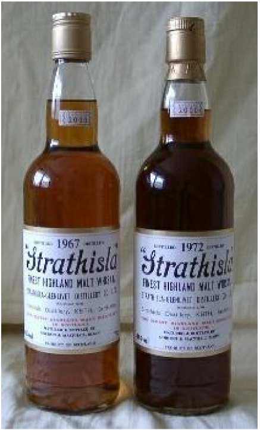|
|A standard G&M bottling, bottled before 1990. The package is quite unadorned and the vision panel is only a thin cellophane film.|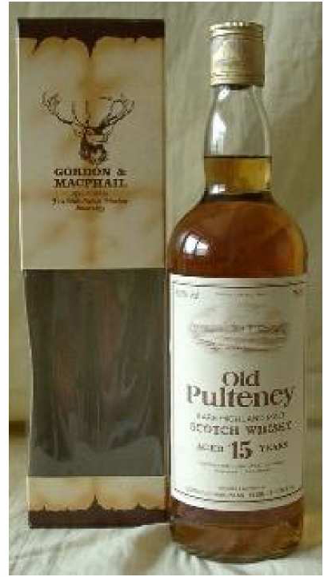|
|Some bottlings with a Distillery-Label from  G&M, which show you the great variety of labels in this range (all 5 photos: Peter Nowacki)|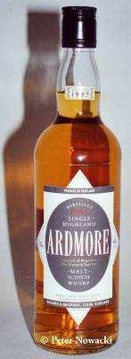 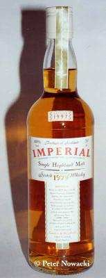 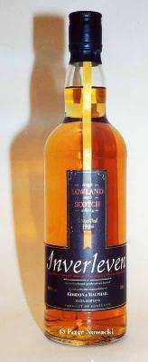 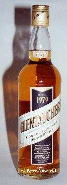 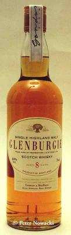|

## Connoiseur's Choice

This is the best known range of G&M. There are bottlings available from more than 40 different distilleries in different ages and vintages. The standard bottling is at 40% ABV, but there have been some bottlings at natural cask strength, too. Sometimes the bottling year is not written on the bottle, so you can only evaluate it by the label. 

The design of the packaging and the label has changed several times, but it’s used always a standard clear glass bottle with screw cap and a cardboard box. The first edition had a red or golden screw cap and a black label with red and gold. Strathisla from the 30’s, Mortlach from the 30’s and 40’s, Talisker from the 50’s and many more were bottled with this label. The edition was very successful and therefore it was extended. 

The second edition got a dark brown label, which was used from the end of the 1970’s until 1988. On every bottle the year of distillation and the age was printed. 

In the following edition a light-brown label was used (1988-1991) with no declaration of the bottling year. These bottles contained 75cl at first. 

In 1991, a small tab with the bottling year was pasted on the shoulder of the bottle and the volume was only 70cl further on. 

Not later than 1997 the tab with the bottling-year was pasted at the neck of the bottle and the label-design has changed. 

From 1999 a cork stopper is used instead of the screw cap. 

And in 2003 the old custom of bottling at 40%ABV is abandonned: now an internal team of experts decides, which ABV (40%, 43% or 46%) would be the best for the bottlings. 

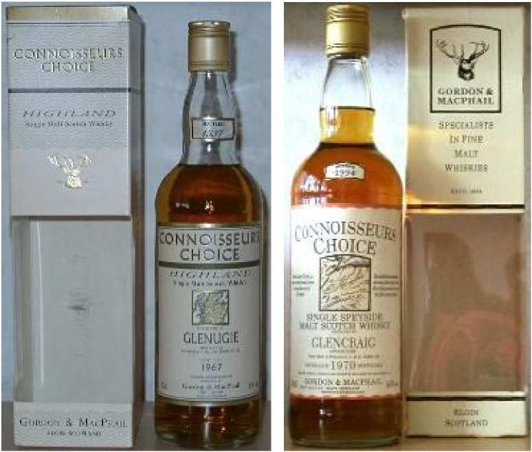

    Left: CC Bottlings from the year 1997.
    Right: CC Bottlings until 1996 (this one´s from 1994) with simple packaging. 

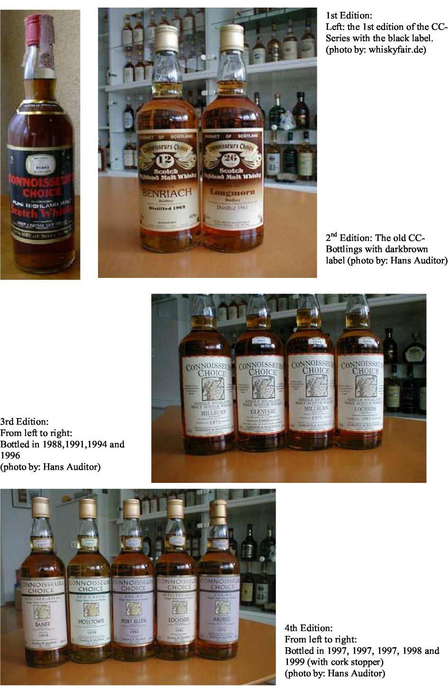

    1st Edition: the 1 st edition of the CCSeries with the black label. (photo by: whiskyfair.de)
    2nd Edition: The old CCBottlings with dark brown label (photo by: Hans Auditor)
    3rd Edition: From left to right: Bottled in 1988,1991,1994 and 1996 (photo by: Hans Auditor)
    4th Edition: From left to right: Bottled in 1997, 1997, 1997, 1998 and 1999 (with cork stopper) (photo by: Hans Auditor)

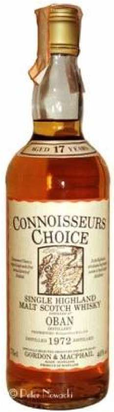

    A rare CC-bottling of an Oban from 1989/90.
    The declaration of the age can be found on the shoulder-label.
    (photo by Peter Nowacki) 

## Cask Strength 

In this range there are only bottlings filled at natural cask strength, as you would expect from the name. The bottle has a cork stopper and is packed in the usual G&M cardboard box. The label is white with the eye-catching writing “Cask”. Further on, the year of distillation, the distillery and the ABV is declared.

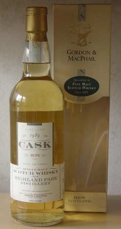

    Stronger: This bottle demonstrates that G&M doesn't bottle at 40% ABV only. 

## Centenary Reserve

The range was released to the 100years-anniversary of Gordon & MacPhail and contains bottlings of different distilleries which were filled at 40% ABV in a bottle with screw cap. It is a two-part label similar to the Rare Old-bottlings. 

At the head there is the writing "Centenary Reserve" and the G&M-logo. At the bottom there is the name of the distillery and the bottling year.

Further on there is a Benromach with the labelling "Centenary Reserve" with a big brown label and similar tube, bottled with screw cap as well. But this one was bottled in 1998, not in 1995! 

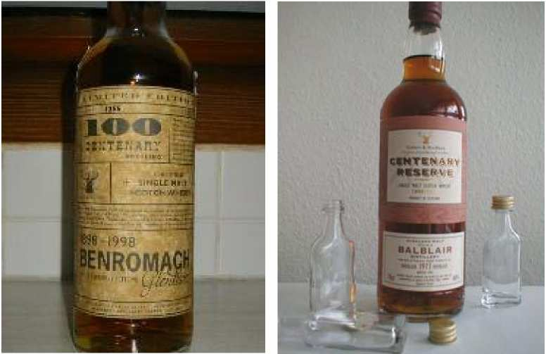

    Centenary Reserve (Benromach) with brown label (on the left, photo by: Flo Borchers)
    And the two-part labelled Centenary Reserve from G&M (on the right, photo by: Hans Auditor)

## Rare Old / Rare Vintage 

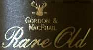

Under the designation Rare Old there are bottled very old malts since 1999. These bottlings are packed in a Wooden Box. The label is divided into two parts: a dark brown “Rare Old” sign and a smaller label with the name of the distillery underneath. These bottles are with cork stopper, non-typical for G&M! These bottlings are either bottled from an rare age group or they are old vintage bottlings.

**Beware:** there are several bottlings of the standard range with the writing "Rare Old" (see photograph). But you cannot count these bottlings among the "Rare Old"-range. A range called RARE VINTAGE contains Single Malts from the 1930s till 1960s. 

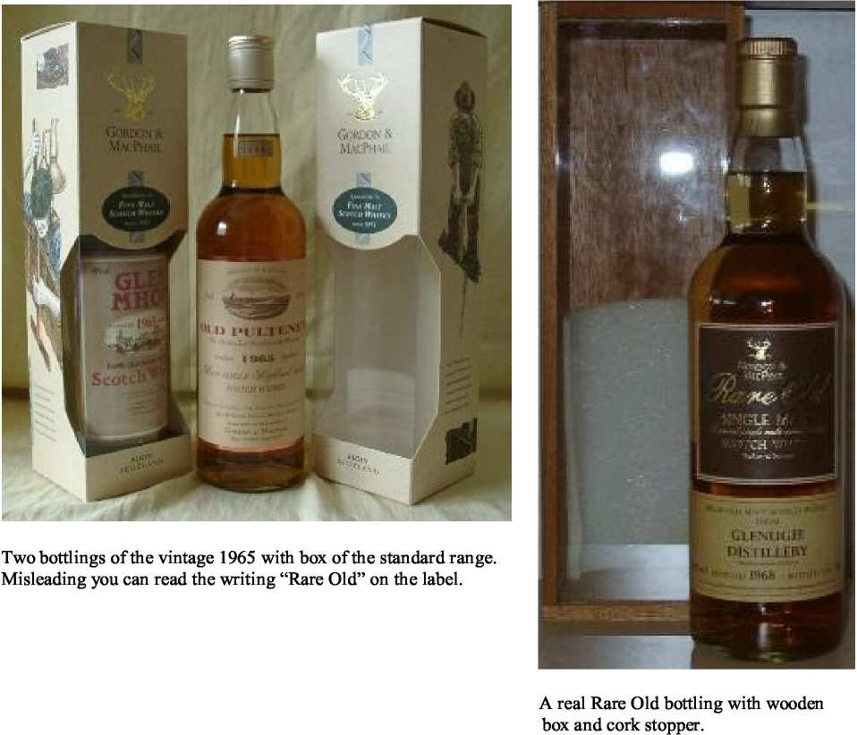

## Speymalt

SPEYMALT is a sub-company of G&M. The Macallan-bottlings are the most popular bottlings of Speymalt. They have been bottled since 1998. These bottlings have a red tape along the bottle.

They are filled at 40%ABV in a standard bottle. The packaging is the usual G&M box or a wooden box for the older and exclusive bottlings. The label Speymalt is also used for exportation but without the red tape –for Meregalli for example. Furtheron, the range of the Label SPIRIT OF SCOTLAND is bottled by “Speymalt Whisky”. 

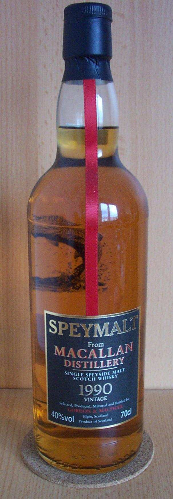

    A typical Macallan from Speymalt: Black Label and a red tape, the year 
    of distillation and the word "Vintage" can be found on the label.  
    Bottled at 40%.  (photo: Lothar Müller)

## Spirit of Scotland

Bottled by the sub-company [Speymalt](#Speymalt), bottlings of this range were bottled at both 40% and natural cask strength also. As a rule of G&M, it is used a standard bottle with screw cap and a small label with the bottling-year patched on the neck of the bottle.

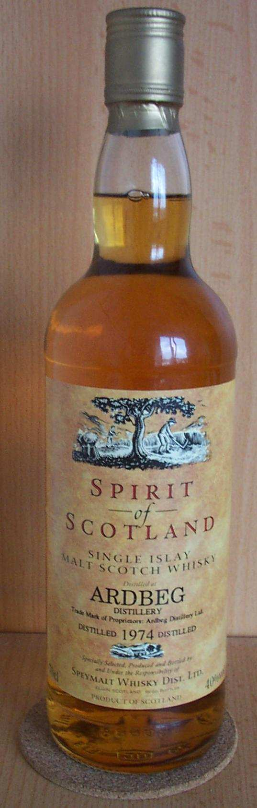

    A 74er Ardbeg from SOS. (photo:Lothar Müller) 

## MacPhails Collection / MacPhail's 

These bottles bear a plain black label. They are bottled at 40% ABV in a standard bottle. A brown tube is used for packing. As a rule young malts at 8-10years are bottled with this label, but there are older whiskies as well.

Under the label MACPHAIL'S a single malt whisky is bottled but not named on the label.  This one is produced for G&M and matured in casks owned by G&M at their warehouses in Elgin or directly at the distillery. There are bottlings in the standard bottle with a lightbrown colored label or with nice decanters as well; showing the so-called "Dram Takers" label. 

|Description|Bottle|
|-----------|------|
|MacPhail’s Decanter: A 22yo. Highland Malt, distilled 1964 (photo: Matthias Bohnsack)|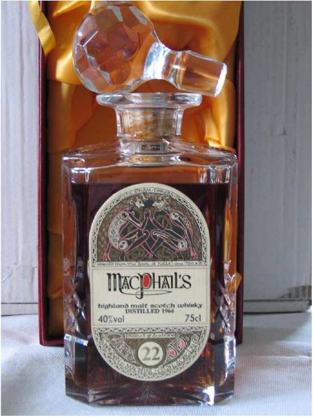|
|MacPhail’s Collection: the Collection-bottling with black label. (photo: Lothar Müller)|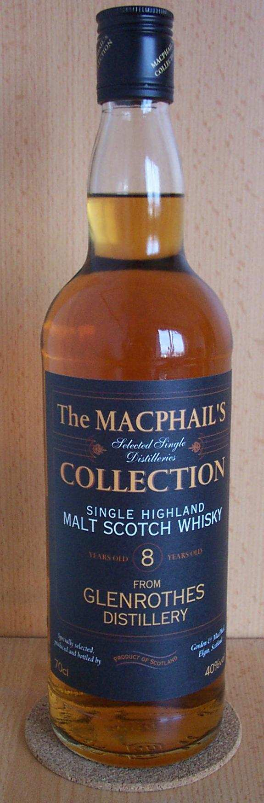|

## Private Collection

In this range, G&M released several Imperial and Caol Ila bottlings with several finishes (cognac, sherry, port) in the year 2001. The Imperial finishes matured in a bourbon refill barrel and then 2 years in the finishing barrel. The Caol Ila bottlings matured in a bourbon refill hogshead before finishing for 2 years as well. All bottlings were filled at 40% ABV in a standard bottle and labelled with a white label with declaration of date of distillation, bottling, cask no. and no. of the bottle.

Later on, there was released also a calvados finish of Imperial and Caol Ila, and in the year 2002 there was bottled a Caol Ila vintage 1965, matured in a refill sherry cask and filled at natural cask strength(!). A green tube is used for packaging. 

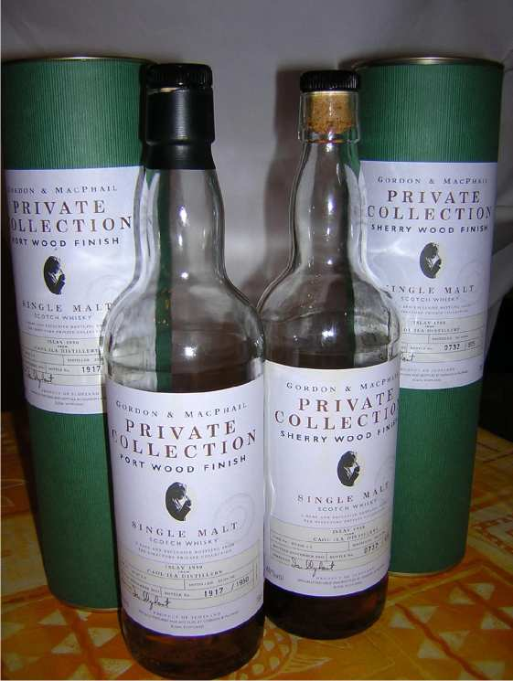

    The Private Collection from G&M. (photo by: Thomas Lipka)

## G&M Reserve

Single cask bottlings from Gordon and MacPhail! Bottled at different ABVs this range is presented with a clear srtandard bottle with clear-label as well as a small green paper label and a green cap. The label displays the distillation and bottling year and the cask number. 

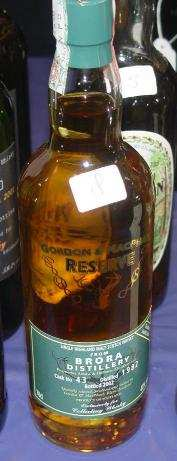

    This Brora was bottled for Collecting Whisky. 

## The Secret Stills
   
For all those who like blind tastings: This range from G&M doesn't name the distillery, but the Region (i.e. Speyside) and started in 2005/2006. The G&M-typical standard bottle is used – the packaging is a cardboard tube with a modern designed label on it. 

## G&M Single Cask

The bottlings in this range were chosen by La Maison du Whisky and bottled by G&M. The range contains whiskies of the principal regions Highlands, Islay, Lowlands and Speyside. They are neither colored nor chill-filtered. On the small neck-label you can find the cask number. The ABV varies among the bottlings. 

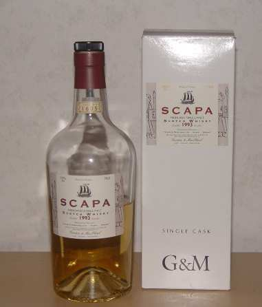

    One Scapa from Single Cask Range with 45% ABV and white cardboard box. It’s unknown if this one counts to one
    of the regions shown on the backside of the box (Islands is not listed there…). 

## Silver Jubilee

A special range bottled in 1977 for the 25yo. jubilee of the Queen, containing whiskies from a variety of different distilleries. The whiskies are all 25yo. in according to the title of the range. A 4-edged bottle is used. It’s estimated, that this range was originally available only on the American market, because the ABV is 70 proof and the size of the bottle is 26 2/3 FL.OZ. As packaging a red box looking like snake leather was used. 

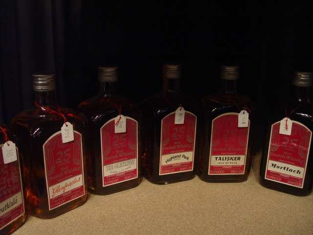

    Jubilee: The red-labeled bottlings of the Silver Jubilee – range. 

## Others

G&M offers a multitude of second labels and ranges. They bottle several blends as well and some malts with new brand names as Glen Gordon, Glen Fraser, Glen Avon, as the original distillery mustn't be named. Further on, there are vatted malts under the label of PRIDE OF (ISLAY, SPEYSIDE and so on). Also worth mentioning there are the old Glen Grant Bottlings in crystal decanters. 

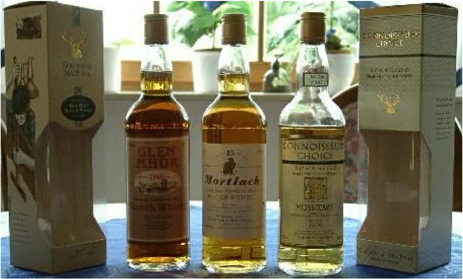

    Little comparison:
    From left to right: standard (Glen Mhor 1965), standard (Mortlach 15yo.), and Connoisseurs Choice-bottling
    from 1997 (Mosstowie 1979). 

[Back to Parent](IndependentBottlers.md)

<!--
TODO: 
* add newer G&M expressions
-->