# Signatory

* Address: Signatory Vintage Scotch Whisky Co. Ltd., 7&8 Elizafield, Bonnington
           Industrial Estate, Newhaven Road, Edinburgh EH6 5PY
* Web: [https://www.signatoryusa.com/](https://www.signatoryusa.com/)
* Tel: +44 131 555 4988 Fax: +44 131 555 5211
* Proprietor: Andrew W. Symington 

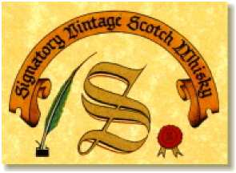

Signatory is a quite young company and was founded not until 1988 in Edinburgh. In 1992 the company enlarged and moved from the original location in Leith to the current location. A small bottling plant was built there. Signatory established to one of the three biggest independent bottlers of single malt whisky within a few years. Until 1998, Brian Symington was co-owner but left the company then.

Primarily there was the idea of signing every bottling-release from a famous person and so dedicating the whisky to this person. But this idea hasn't been implemented, because there were no person found to sign the bottles, as the first cask, a Glenlivet 1968, was bottled. With only 100,000 GBP Signatory was founded and within the first 5 years the company went almost bankrupt--more than one time. 

In 1993 Signatory has managed to work with at a profit and had a name in the whisky-business with their vintage-bottlings.   Today, Signatory is the second largest independent bottler of whisky in Scotland and was awarded “Bottler of the year” in 2002.  In August of 2002, Signatory bought a distillery also: Edradour, the smallest scottish distillery.

The focus of Signatory is on single-cask bottlings at natural cask strength or at 43% ABV. On every bottle the cask no., the no. of the bottle, the amount of bottles and the date of distillation and bottling is declared. According to his account the owner opens every cask and satisfies himself of the quality of the content.

A multitude of severals ranges and second-labels from Signatory exists. Sometimes, there were cask-vattings (4-5 casks together), which where sold under several labels (i.e. Dun Eideann, Signatory, Ultimate) with identically cask-declaring.

The company caused a sensation with two bottlings of long closed distilleries like Killyloch and Ben Wyvis. 

## The Prestonfield

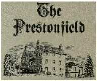

The Prestonfield is one of the second-labels of Signatory. It is used for France for the Whisky-Shop "La Maison du Whisky." The bottles are in a solid cardboard-box with leather imitation and vision panel. The Whisky is bottled
at natural cask-strength or drinking strength and filled up in a clear glass bottle, as a rule it is a single cask bottling. 

Cask no., bottle no.and the amount of bottles are declared as usual for Signatory. Some of the labels have avery colourful design (i.e. a Springbank-bottling). Also a blended whisky and a vatted malt is bottled under The Prestonfield-label. 

"The Prestonfield" is a hotel the Symington-brothers worked for in the 80’s. At that time, they organized some private bottlings for this hotel. This was the beginning of Andrew Symington's relationship to whisky.  These old bottlings have no relations to France and "La Maison." Apparently the Symingtons got the right to the name "The Prestonfield." 

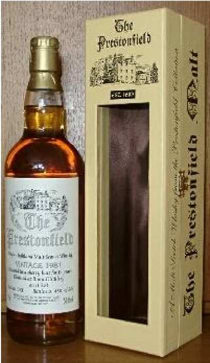

    Brora 1981 at natural cask strength in a yellow box. This bottle
    is from France and was bottled in 2000.

## Dun Eideann

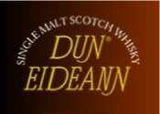

Dun Eideann is another second-label of Signatory which is used for several markets in spite of providing competition against the Signatory bottlings. These whiskies are filled at 40% ABV in a clear glass bottle. They are packed in a red velvet-box with vision panel or in a simple cardboard box. 

There are premium bottlings with a decanter and a wooden box as well.

These bottlings are chiefly for the swiss market (Wine and Spirit Club Divo), for France (Auxil Import), for Italy (Donato & Co) and for Spain. The longest trade connections consists with Italy since the end of the 80’s. The bottlings for the swiss and french market have a label in gold brocade design. 

There is an italian website for Dun Eideann: [http://donato-ge.com/whisky.html](http://donato-ge.com/whisky.html)

TODO: ^ is this still Signatory?

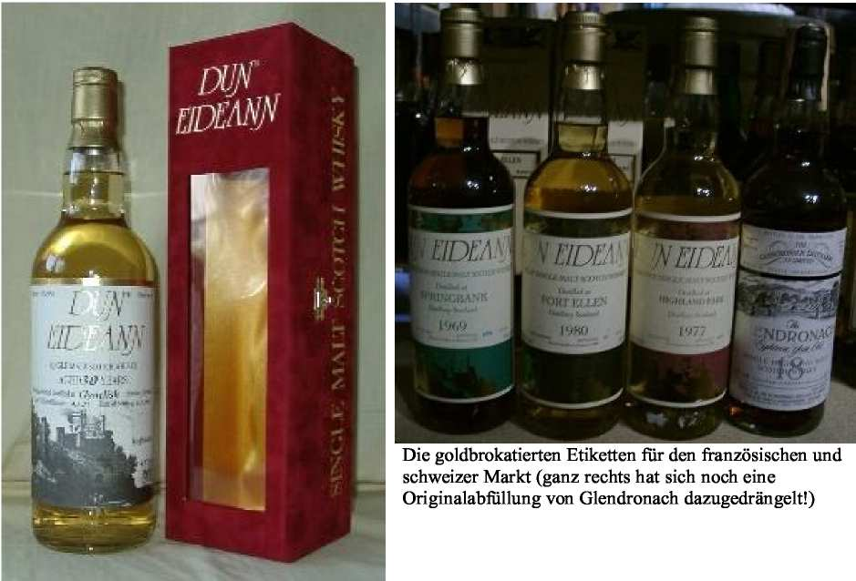

    The red velvet-style box from Dun Eideann (for Italy) with gold writing and a "Castle-lable".

## Signatory Vintage

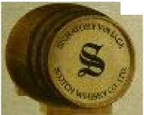

The Signatory Vintage range is filled at 43% ABV in a standard clear glass bottling and packed in a metal tube in principal. This is the standard edition of Signatory and is sold at a moderate price. 

The colour of the tube varies in dependence of the whisky-region: 
* yellow for Highland
* light-blue for Islay
* green-yellow for Lowland. 

From the year 2000 there are two-parted tubes, above in yellow colour, and copper-coloured underneath. Latter there are bottlings with the writing "natural colour", which shows that the whisky is not artificially coloured. This seems to be necessary because of the discussion about artificial colour by the customers. According to their account, Signatory has never used artificial colour at any time. 

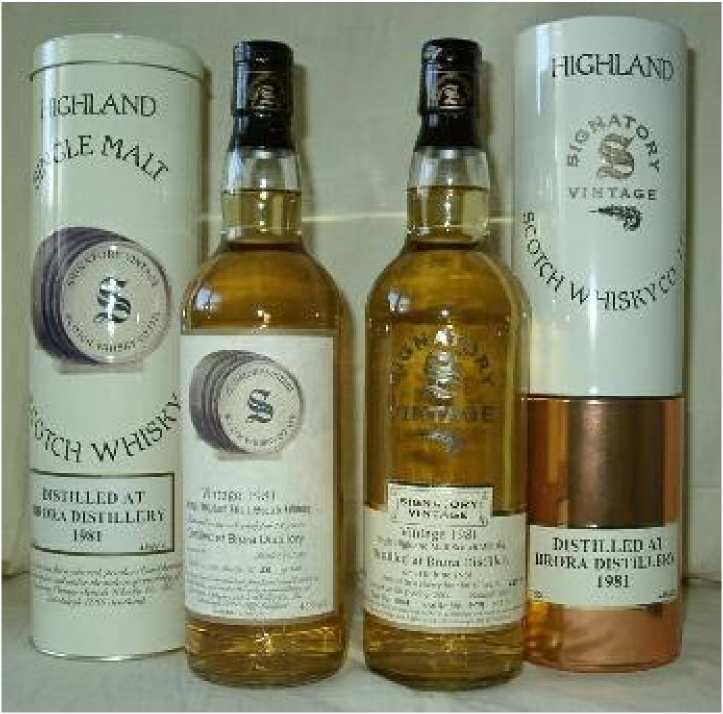

    Two Broras from 1981:
    The left one is bottled in 1999, the right one in the year 2000. 
    You can see the label has changed as well and the bottle bears a clear-label "S" now 

## Signatory Vintage Cask Strength 

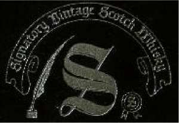

In this range are only whiskies at natural cask strength, the upmarket range of Signatory. The price varies from age, and popularity of the distillery. There are quite rare and excellent bottlings among them!  In 2004 Signatory started a completely new packaging! The box was replaced by an oval tinbox and the bottle has changed to a decanter. 

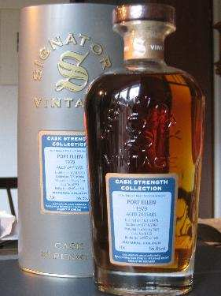 
 
     The new look of the Vintage caskstrength range from Signatory. (photo: Matthias Bohnsack)

Prior to 2004, they were filled in a dumpy bottle and packed in a velvety cardboard box.  The colour of the boxes varies, there are red, fawn, blue and black boxes, but there is no relation to the whisky-regions. The label with the typical vintage-barrel varies between light blue and fawn colours.

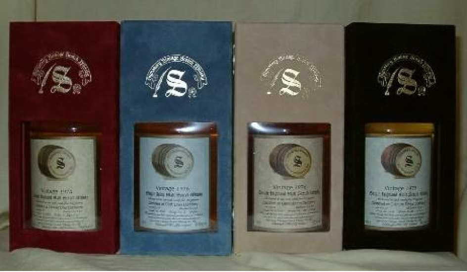
     
     Colourful: Dumpy-bottles in different coloured velvety boxes (darkblue is absent on the photograph)

These cask-strength bottlings are natural colour, but some may have been chillfiltered in the past. This should be increasingly unlikely with newer bottlings.

## Silent Stills

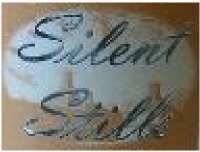

In this range there should be only whiskies of closed, mothballed or dismantled distilleries. But there are bottlings of producing distilleries as well, as you can see on the photograph. ( This Bladnoch was bottled on 31.1.2000. Bladnoch was reopened later in the year 2000, so strictly speaking it was silent at the bottling-time.) 

The bottlings are filled at natural cask-strength and seem to be intended for collectors. 

The dumpy-bottles with long neck are packed in a wooden box with a miniature of the whisky and a round piece of wood. This should be from the head of the barrel. The labels are in different colours. Since 1997, there will be a release of circa 6 bottlings per annum.
 
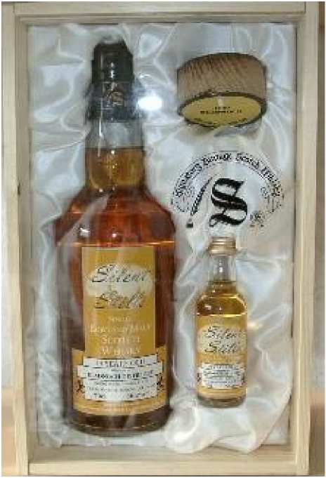
 
    Whisky in a box:
    Bottlings of the Silent Still-range will be delivered with a miniature and a barrel-piece. Here you can see a Bladnoch. 

## Un-chillfiltered Collection
 
This range contains un-chill-filtered and non-coloured whiskies bottled at 46% ABV. Because customers were setting store by natural bottlings, Signatory apparently saw a chance in the market.

This range was released about the year 2000. The package is a metal-tube with the typical Signatory-"S" and a label which declares the distillery name and the date of distillation. The standard-bottle bears a label with every information in the typical Signatory-style. Sometimes you will find the standard tube which bears a small additional "Un-chillfiltered Collection" label. 

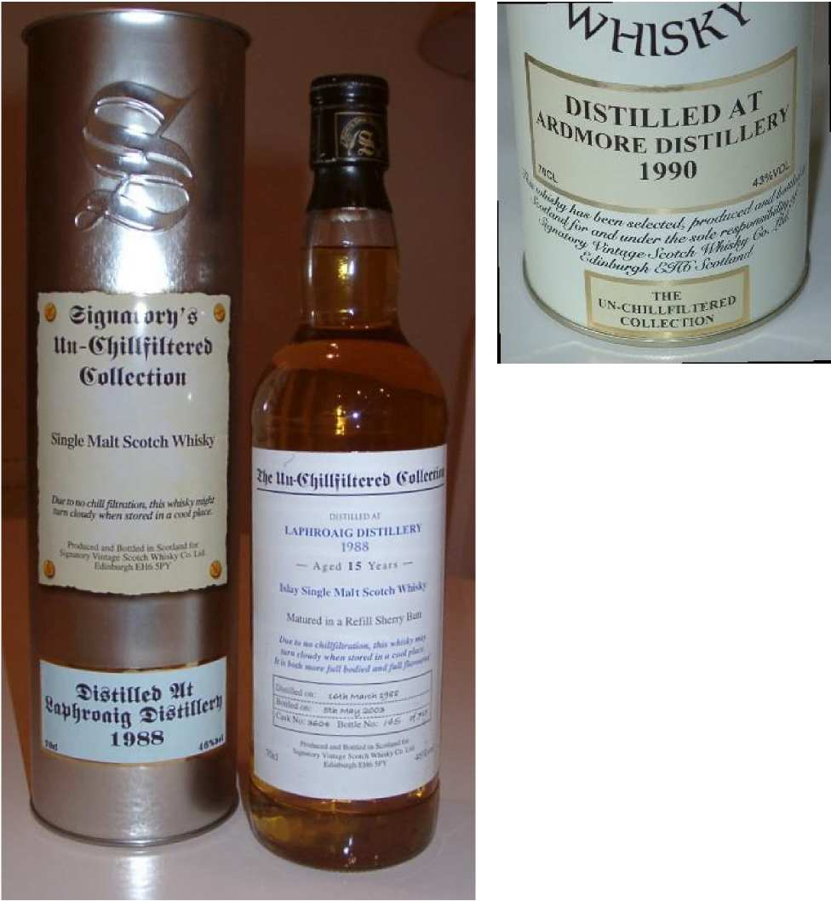

    Left pic: Silver the package, golden the content of the bottle: the Unchillfiltered Collection (photo by: Flo Borchers)
    Right pic: The additional Label placed on a standard tube. 
 
## Decanter Collection

The Decanter Collection was released in 2002. The decanters bear only a clear label and the details of the bottling are on a tag, fixed on the neck of the bottle. 

The package is a pseudometal cardboard-tube. The bottle is straight with a very short neck. Although it doesn't really look like a decanter it is a very unusual bottle-type and looks pretty with the gleamy tube. The bottlings of the Decanter Collection are mid-to-highly-priced. 

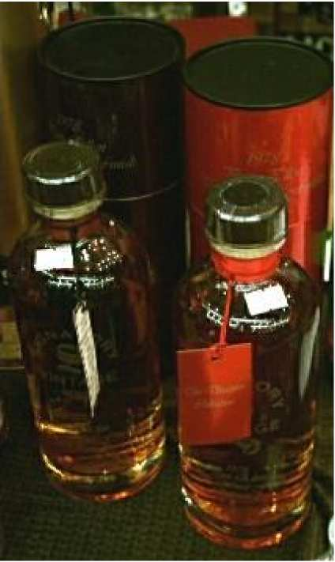

    The Decanter-Collection from Signatory. 

##  Sailing Ships Series

One of the early ranges of Signatory, starting in 1988 but stopped later. There were many miniatures in tartan-style boxes. The label showed a sailing ship. 

The big bottles were in a big blue box with a sailing ship as well. Every box contains a leaflet with the history of the ship which is on the label. 

These bottlings were in a standard-style bottle and filled at 40% ABV. They weren't single cask bottlings but vatted from several casks. Sometimes, the same batch have been divided and bottled on the one hand under the label "Sailing Ships" and on the other hand for "The Prestonfield." 

## Scottish Wildlife

Another early range from Signatory – probably their first range. Bottled in the standard bottle and with 43% ABV the label shows a simple black and white picture of the scottish wildlife. Four bottlings were released and all are 10yo.

|Port Ellen|Balmenach|
|:--------:|:-------:|
|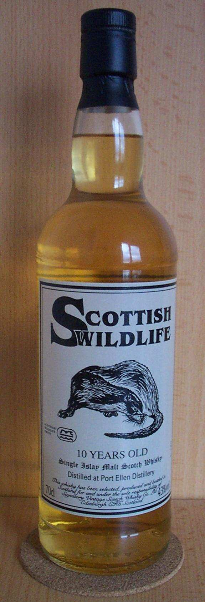|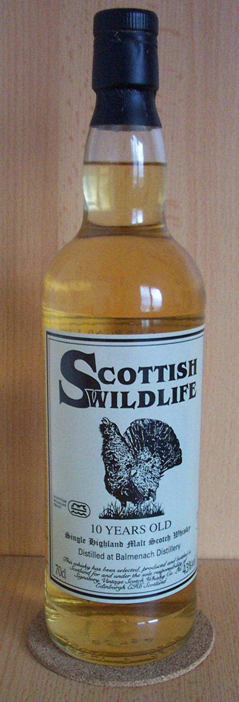|

    Bottlings from the Scottish-Wildlife-range from Signatory. (photos: Lothar Müller) 

## Others

Signatory offers a lot more ranges at different price classes. So there is a range with a big wooden box, which contains a glas and a miniature as well, some millenium-bottlings in different ranges, Big-box range, Very Rare and Old, a range Caol Ila resp. Port Ellen “3XXX days old” for KirschImport (Germany), and many miniatures in tin-tubes. There are offered many so called half-bottles with 0,375l resp. 0,35l, with screw cap and tube.

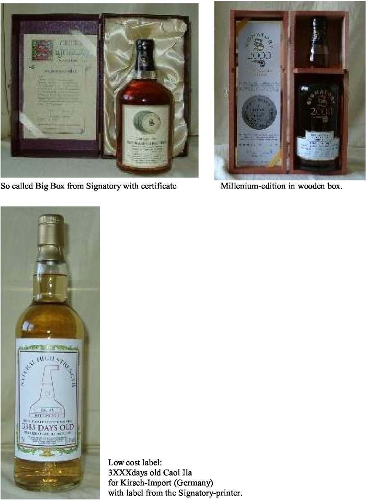

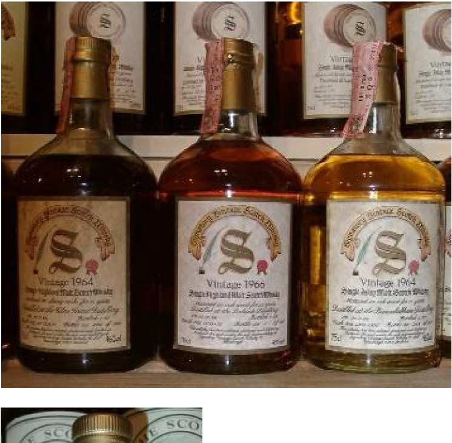

    These dumpy bottles have been bottled around 1988/89. 
    With big "S" and bottled at 43% and an untypical 46% ABV. 

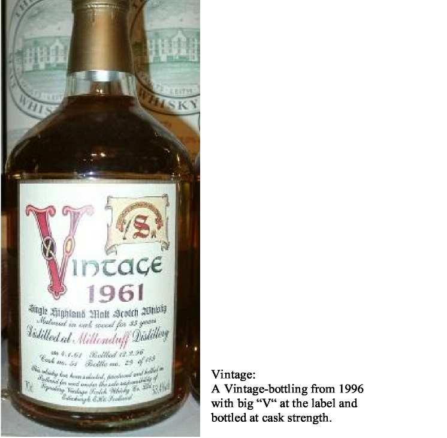

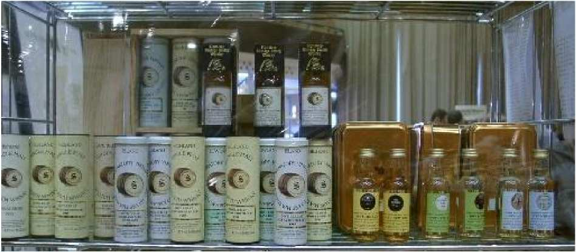

    Signatory- miniatures in many variations:
    With metal or cardboard-tube, in black box or in tin-box as a set.

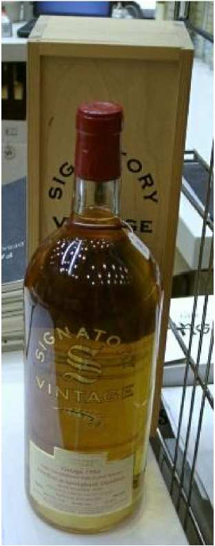

    Big One: A Signatory-bottling with wooden box and 3 l content, bottled for the Millenium. 

[Back to Parent](IndependentBottlers.md)

<!--
TODO: 
* add missing product lines, new photos
* add new hazy SV line 
-->